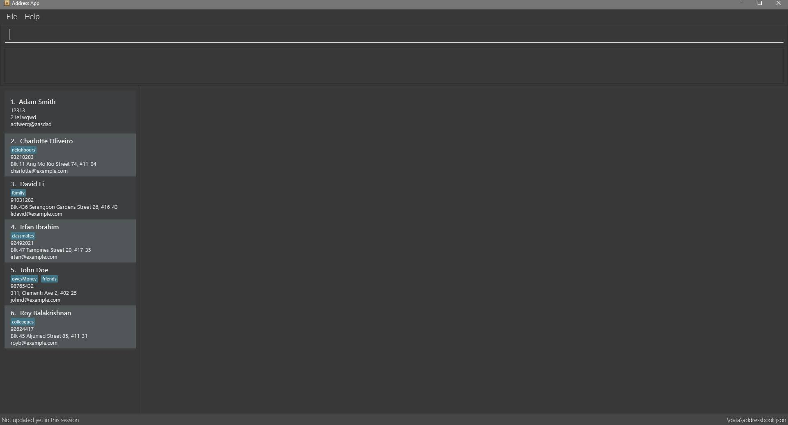

= Recruit Me
ifdef::env-github,env-browser[:relfileprefix: docs/]

https://travis-ci.org/se-edu/addressbook-level4[image:https://travis-ci.org/se-edu/addressbook-level4.svg?branch=master[Build Status]]
https://ci.appveyor.com/project/damithc/addressbook-level4[image:https://ci.appveyor.com/api/projects/status/3boko2x2vr5cc3w2?svg=true[Build status]]
https://coveralls.io/github/se-edu/addressbook-level4?branch=master[image:https://coveralls.io/repos/github/se-edu/addressbook-level4/badge.svg?branch=master[Coverage Status]]
https://www.codacy.com/app/damith/addressbook-level4?utm_source=github.com&utm_medium=referral&utm_content=se-edu/addressbook-level4&utm_campaign=Badge_Grade[image:https://api.codacy.com/project/badge/Grade/fc0b7775cf7f4fdeaf08776f3d8e364a[Codacy Badge]]
https://gitter.im/se-edu/Lobby[image:https://badges.gitter.im/se-edu/Lobby.svg[Gitter chat]]

ifdef::env-github[]

endif::[]

ifndef::env-github[]
image::images/Ui.jpg[width="600"]
endif::[]

* This is a desktop recruiting application. It has a GUI but most of the user interactions happen using a CLI (Command Line Interface).
* It is a Java application that is intended for a company looking to recruit new employees.
* Employer is able to find applicants that meet the needs of the company.
* In Version 1.1:
** Tag usage for multiple categories: technical skills, professional skills, experience level.
** Basic implementation of filtering system will be added to the application, that filters the contacts according to one of their properties.
** Parameters for each contact to include valuable information for clients in their profile: Education, Grade point average.
** A general method for sorting a data set with the structure used in.
* In Version 1.2:
** Tag search function with keyword tag. Creating color coordination for each category in UI.
** Filtering system will be improved and filtering for multiple entries will be added.
** Implement method into application ensuring it is callable through the keyword sort. The sort feature should also be able to account for new parameters (e.g. Birthday, Education level etc.) as the client requires.

== Site Map

* <<UserGuide#, User Guide>>
* <<DeveloperGuide#, Developer Guide>>
* <<LearningOutcomes#, Learning Outcomes>>
* <<AboutUs#, About Us>>
* <<ContactUs#, Contact Us>>

== Acknowledgements

* Some parts of this sample application were inspired by the excellent http://code.makery.ch/library/javafx-8-tutorial/[Java FX tutorial] by
_Marco Jakob_.
* Libraries used: https://github.com/TestFX/TestFX[TextFX], https://github.com/FasterXML/jackson[Jackson], https://github.com/google/guava[Guava], https://github.com/junit-team/junit5[JUnit5]

== Licence : link:LICENSE[MIT]
