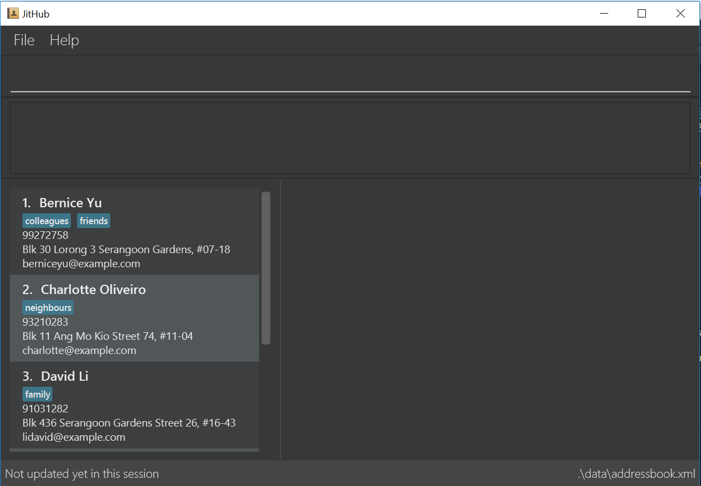

= CAPTracker
ifdef::env-github,env-browser[:relfileprefix: docs/]

https://travis-ci.org/CS2103-AY1819S1-T13-4/main[image:https://travis-ci.org/CS2103-AY1819S1-T13-4/main.svg?branch=master[Build Status]]
https://ci.appveyor.com/project/alexkmj/main/branch/master[image:https://ci.appveyor.com/api/projects/status/1sxo4mvlcd5oia7h?svg=true[Build Status]]
https://coveralls.io/github/CS2103-AY1819S1-T13-4/main?branch=master[image:https://coveralls.io/repos/github/CS2103-AY1819S1-T13-4/main/badge.svg?branch=master[Coverage Status]]
image:https://api.codacy.com/project/badge/Grade/28acc5b7c04044519964e6253aeb58fa["Codacy code quality", link="https://www.codacy.com/app/alexkmj/main?utm_source=github.com&utm_medium=referral&utm_content=CS2103-AY1819S1-T13-4/main&utm_campaign=Badge_Grade"]

ifdef::env-github[]

endif::[]

ifndef::env-github[]
image::images/Ui.png[width="600"]
endif::[]

* CAPTracker is for those students who prefer to use a desktop app for calculating and managing their CAP. More importantly CAPTracker is optimized for those who prefer to work with a Command Line Interface (CLI) while still having the benefits of a Graphical User Interface (GUI). If you can type fast, CAPTracker is the ideal application to calculate your current CAP, and predict what grades you need in modules you haven’t taken to achieve your ideal CAP.

== Site Map

* <<UserGuide#, User Guide>>
* <<DeveloperGuide#, Developer Guide>>
* <<AboutUs#, About Us>>
* <<ContactUs#, Contact Us>>

== Acknowledgements

* Some parts of this sample application were inspired by the excellent http://code.makery.ch/library/javafx-8-tutorial/[Java FX tutorial] by
_Marco Jakob_.
* Libraries used: https://github.com/TestFX/TestFX[TextFX], https://bitbucket.org/controlsfx/controlsfx/[ControlsFX], https://github.com/FasterXML/jackson[Jackson], https://github.com/google/guava[Guava], https://github.com/junit-team/junit5[JUnit5]

== Licence : link:LICENSE[MIT]
