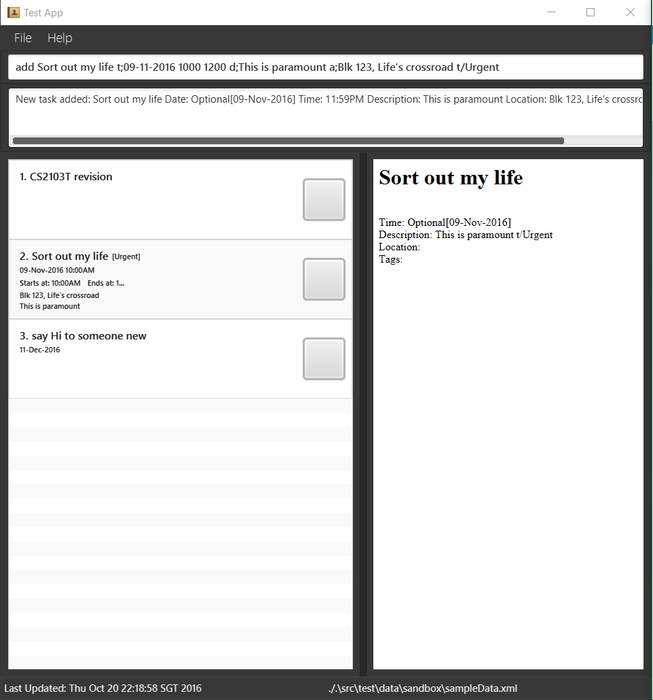

# SmartyDo

 

* This is a desktop time scheduler application. It has a GUI but most of the user interactions happen using 
  a CLI (Command Line Interface).

  
#### Site Map
* [User Guide](docs/UserGuide.md) 
* [Developer Guide](docs/DeveloperGuide.md) 
* [About Us](docs/AboutUs.md)
* [Contact Us](docs/ContactUs.md)