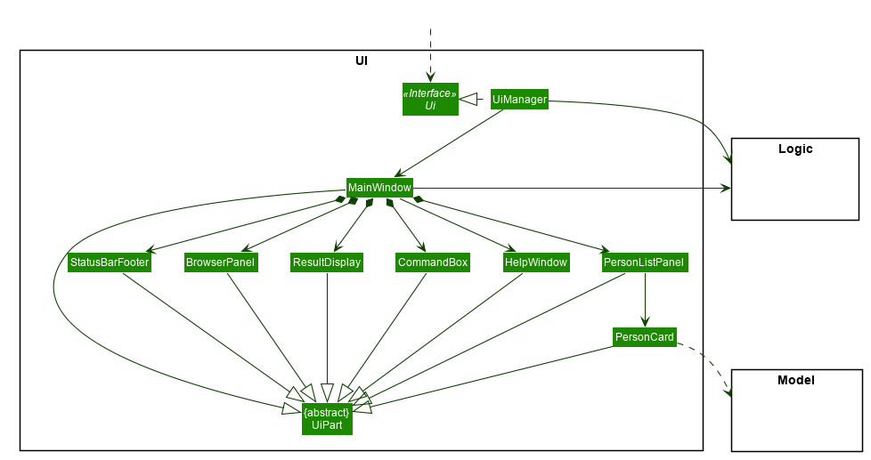
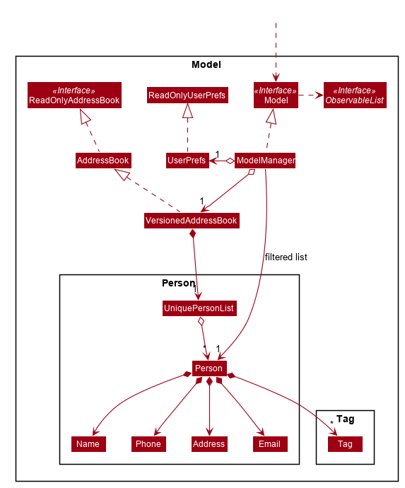
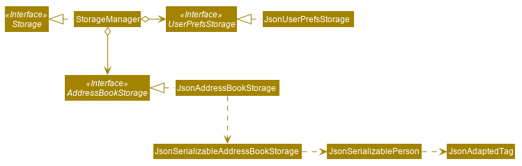

= AddressBook Level 4 - Developer Guide
:toc:
:toc-placement: preamble

By : `Team SE-EDU`      Since: `Jun 2016`      Licence: `MIT`

== Setting up

=== Prerequisites

.  *JDK `1.8.0_60`* or later
+
[NOTE]
Having any Java 8 version is not enough. This app will not work with
earlier versions of Java 8.
+
. *Eclipse* IDE
. *e(fx)clipse* plugin for Eclipse (Do the steps 2 onwards given in
http://www.eclipse.org/efxclipse/install.html#for-the-ambitious[this
page])
. *Buildship Gradle Integration* plugin from the Eclipse Marketplace
. *Checkstyle Plug-in* plugin from the Eclipse Marketplace

=== Importing the project into Eclipse

. Fork this repo, and clone the fork to your computer
. Open Eclipse (Note: Ensure you have installed the *e(fx)clipse* and
*buildship* plugins as given in the prerequisites above)
. Click `File` > `Import`
. Click `Gradle` > `Gradle Project` > `Next` > `Next`
. Click `Browse`, then locate the project's directory
. Click `Finish`
+
[role="details"]
****
* If you are asked whether to 'keep' or 'overwrite' config files, choose
to 'keep'.
* Depending on your connection speed and server load, it can even take
up to 30 minutes for the set up to finish (This is because Gradle
downloads library files from servers during the project set up process)
* If Eclipse auto-changed any settings files during the import process,
you can discard those changes.
****

=== Configuring Checkstyle

.  Click `Project` -> `Properties` -> `Checkstyle` ->
`Local Check Configurations` -> `New...`
.  Choose `External Configuration File` under `Type`
.  Enter an arbitrary configuration name e.g. addressbook
.  Import checkstyle configuration file found at
`config/checkstyle/checkstyle.xml`
.  Click OK once, go to the `Main` tab, use the newly imported check
configuration.
.  Tick and select `files from packages`, click `Change...`, and select
the `resources` package
.  Click OK twice. Rebuild project if prompted

[NOTE]
====
Click on the `files from packages` text after ticking in order
to enable the `Change...` button
====

=== Troubleshooting project setup

*Problem: Eclipse reports compile errors after new commits are pulled
from Git*

* Reason: Eclipse fails to recognize new files that appeared due to the
Git pull.
* Solution: Refresh the project in Eclipse: Right click on the project
(in Eclipse package explorer), choose `Gradle` ->
`Refresh Gradle Project`.

*Problem: Eclipse reports some required libraries missing*

* Reason: Required libraries may not have been downloaded during the
project import.
* Solution: link:UsingGradle.md[Run tests using Gradle] once (to refresh
the libraries).

== Design

=== Architecture

[[img-architecture]]
[.text-center]
image::images/Architecture.png[title="Architecture Diagram", width="600"]

The <> given above explains the high-level design
of the App. Given below is a quick overview of each component.

[TIP]
====
The `.pptx` files used to create diagrams in this document can be
found in the link:diagrams/[diagrams] folder. To update a diagram,
modify the diagram in the pptx file, select the objects of the diagram,
and choose `Save as picture`.
====

`Main` has only one class called
link:../src/main/java/seedu/address/MainApp.java[`MainApp`]. It is
responsible for,

* At app launch: Initializes the components in the correct sequence, and
connects them up with each other.
* At shut down: Shuts down the components and invokes cleanup method
where necessary.

<<common-classes,*`Commons`*>> represents a collection of classes
used by multiple other components. Two of those classes play important
roles at the architecture level.

* `EventsCenter` : This class (written using
https://github.com/google/guava/wiki/EventBusExplained[Google's Event
Bus library]) is used by components to communicate with other components
using events (i.e. a form of _Event Driven_ design)
* `LogsCenter` : Used by many classes to write log messages to the App's
log file.

The rest of the App consists of four components.

* <<ui-component, *`UI`*>> : The UI of the App.
* <<logic-component,*`Logic`*>> : The command executor.
* <<model-component, *`Model`*>> : Holds the data of the App
in-memory.
* <<storage-component, *`Storage`*>> : Reads data from, and writes
data to, the hard disk.

Each of the four components

* Defines its _API_ in an `interface` with the same name as the
Component.
* Exposes its functionality using a `{Component Name}Manager` class.

For example, the `Logic` component (see the class diagram given below)
defines it's API in the `Logic.java` interface and exposes its
functionality using the `LogicManager.java` class.

[[img-logic]]
[.text-center]
image::images/LogicClassDiagram.png[title="Class Diagram of the Logic Component", width="800"]

:numbered!:

==== Events-Driven nature of the design

:numbered:

The _Sequence Diagram_ below shows how the components interact for the
scenario where the user issues the command `delete 1`.

[.text-center]
image::images/SDforDeletePerson.png[title="Component interactions for `delete 1` command (part 1)", width="800"]

[NOTE]
====
Note how the `Model` simply raises a `AddressBookChangedEvent` when the
Address Book data are changed, instead of asking the `Storage` to save
the updates to the hard disk.
====

The diagram below shows how the `EventsCenter` reacts to that event,
which eventually results in the updates being saved to the hard disk and
the status bar of the UI being updated to reflect the 'Last Updated'
time.

[[img-delete-event]]
[.text-center]
image::images/SDforDeletePersonEventHandling.png[title="Component interactions for `delete 1` command (part 2)", width="800"]

[NOTE]
====
Note how the event is propagated through the `EventsCenter` to the
`Storage` and `UI` without `Model` having to be coupled to either of
them. This is an example of how this Event Driven approach helps us
reduce direct coupling between components.
====

The sections below give more details of each component.

=== UI component

Author: Alice Bee

[.text-center]

*API* : link:../src/main/java/seedu/address/ui/Ui.java[`Ui.java`]

The UI consists of a `MainWindow` that is made up of parts
e.g.`CommandBox`, `ResultDisplay`, `PersonListPanel`, `StatusBarFooter`,
`BrowserPanel` etc. All these, including the `MainWindow`, inherit from
the abstract `UiPart` class and they can be loaded using the
`UiPartLoader`.

The `UI` component uses JavaFx UI framework. The layout of these UI
parts are defined in matching `.fxml` files that are in the
`src/main/resources/view` folder. For example, the layout of the
link:../src/main/java/seedu/address/ui/MainWindow.java[`MainWindow`] is
specified in
link:../src/main/resources/view/MainWindow.fxml[`MainWindow.fxml`]

The `UI` component,

* Executes user commands using the `Logic` component.
* Binds itself to some data in the `Model` so that the UI can
auto-update when data in the `Model` change.
* Responds to events raised from various parts of the App and updates
the UI accordingly.

=== Logic component

Author: Bernard Choo

[.text-center]
image::images/LogicClassDiagram.png[title="Structure of the Logic Component", width="800"]

*API* :
link:../src/main/java/seedu/address/logic/Logic.java[`Logic.java`]

. `Logic` uses the `Parser` class to parse the user command.
. This results in a `Command` object which is executed by the
`LogicManager`.
. The command execution can affect the `Model` (e.g. adding a person)
and/or raise events.
. The result of the command execution is encapsulated as a
`CommandResult` object which is passed back to the `Ui`.

Given below is the Sequence Diagram for interactions within the `Logic`
component for the `execute("delete 1")` API call.

[.text-center]
image::images/DeletePersonSdForLogic.png[title="Interactions Inside the Logic Component for the `delete 1` Command", width="800"]

=== Model component

Author: Cynthia Dharman

[.text-center]

*API* :
link:../src/main/java/seedu/address/model/Model.java[`Model.java`]

The `Model`,

* stores a `UserPref` object that represents the user's preferences.
* stores the Address Book data.
* exposes a `UnmodifiableObservableList<ReadOnlyPerson>` that can be
'observed' e.g. the UI can be bound to this list so that the UI
automatically updates when the data in the list change.
* does not depend on any of the other three components.

=== Storage component

Author: Darius Foong

[.text-center]

*API* :
link:../src/main/java/seedu/address/storage/Storage.java[`Storage.java`]

The `Storage` component,

* can save `UserPref` objects in json format and read it back.
* can save the Address Book data in xml format and read it back.

=== Common classes

Classes used by multiple components are in the
`seedu.addressbook.commons` package.

== Implementation

=== Logging

We are using `java.util.logging` package for logging. The `LogsCenter`
class is used to manage the logging levels and logging destinations.

* The logging level can be controlled using the `logLevel` setting in
the configuration file (See link:#configuration[Configuration])
* The `Logger` for a class can be obtained using
`LogsCenter.getLogger(Class)` which will log messages according to the
specified logging level
* Currently log messages are output through: `Console` and to a `.log`
file.

*Logging Levels*

* `SEVERE` : Critical problem detected which may possibly cause the
termination of the application
* `WARNING` : Can continue, but with caution
* `INFO` : Information showing the noteworthy actions by the App
* `FINE` : Details that is not usually noteworthy but may be useful in
debugging e.g. print the actual list instead of just its size

=== Configuration

Certain properties of the application can be controlled (e.g App name,
logging level) through the configuration file (default: `config.json`):

== Testing

Tests can be found in the `./src/test/java` folder.

**In Eclipse**:

* To run all tests, right-click on the `src/test/java` folder and choose
`Run as` > `JUnit Test`
* To run a subset of tests, you can right-click on a test package, test
class, or a test and choose to run as a JUnit test.

**Using Gradle**: * See UsingGradle.md for how to run tests using
Gradle.

We have two types of tests:

. *GUI Tests* - These are _System Tests_ that test the entire App by
simulating user actions on the GUI. These are in the `guitests` package.
. *Non-GUI Tests* - These are tests not involving the GUI. They
include,
.. _Unit tests_ targeting the lowest level methods/classes.
e.g. `seedu.address.commons.UrlUtilTest`
.. _Integration tests_ that are checking the integration of multiple
code units (those code units are assumed to be working).
e.g. `seedu.address.storage.StorageManagerTest`
.. Hybrids of unit and integration tests. These test are checking
multiple code units as well as how the are connected together.
e.g. `seedu.address.logic.LogicManagerTest`

Headless GUI Testing

Thanks to the https://github.com/TestFX/TestFX[TestFX] library we use,
our GUI tests can be run in the _headless_ mode. In the headless mode,
GUI tests do not show up on the screen. That means the developer can do
other things on the Computer while the tests are running. See
link:UsingGradle.md#running-tests[UsingGradle.md] to learn how to run
tests in headless mode.

=== Troubleshooting tests

*Problem: Tests fail because NullPointException when AssertionError is
expected*

* Reason: Assertions are not enabled for JUnit tests. This can happen if
you are not using a recent Eclipse version (i.e. _Neon_ or later)
* Solution: Enable assertions in JUnit tests as described
http://stackoverflow.com/questions/2522897/eclipse-junit-ea-vm-option[here].
Delete run configurations created when you ran tests earlier.

== Dev Ops

=== Build Automation

See UsingGradle.md to learn how to use Gradle for build automation.

=== Continuous Integration

We use https://travis-ci.org/[Travis CI] and
https://www.appveyor.com/[AppVeyor] to perform _Continuous Integration_
on our projects. See UsingTravis.md and UsingAppVeyor.md for more
details.

=== Making a Release

Here are the steps to create a new release.

. Generate a JAR file link:UsingGradle.md#creating-the-jar-file[using
Gradle].
. Tag the repo with the version number. e.g. `v0.1`
. https://help.github.com/articles/creating-releases/[Create a new
release using GitHub] and upload the JAR file you created.

=== Managing Dependencies

A project often depends on third-party libraries. For example, Address
Book depends on the http://wiki.fasterxml.com/JacksonHome[Jackson
library] for XML parsing. Managing these _dependencies_ can be automated
using Gradle. For example, Gradle can download the dependencies
automatically, which is better than these alternatives. a. Include those
libraries in the repo (this bloats the repo size) b. Require developers
to download those libraries manually (this creates extra work for
developers)

[appendix]
== User Stories

Priorities:
High (must have) : * * * ,
Medium (nice to have) : * *,
Low (unlikely to have) : *

[options="header",cols="2,3,4,6"]
|===
|Priority |As a ... |I want to ... |So that I can...

|`* * *`
|new user
|see usage instructions
|refer to instructions when I forget how to use the App

|`* * *`
|user
|add a new person
|

|`* * *`
|user
|delete a person
|remove entries that I no longer need

|`* * *`
|user
|find a person by name
|locate details of persons without having to go through the entire list

|`* *`
|user
|hide link:#private-contact-detail[private contact details]
by default
|minimize chance of someone else seeing them by accident

|`*`
|user with many persons in the address book |sort persons by name
|locate a person easily
|
|===

{More to be added}

[appendix]
== Use Cases

(For all use cases below, the *System* is the `AddressBook` and the
*Actor* is the `user`, unless specified otherwise)

=== Use case: Delete person

*MSS*

.  User requests to list persons
.  AddressBook shows a list of persons
.  User requests to delete a specific person in the list
.  AddressBook deletes the person Use case ends.

*Extensions*

2a. The list is empty
[role="details"]
****
Use case ends
****

3a. The given index is invalid
[role="details"]
****
3a1. AddressBook shows an error message Use case resumes at step 2
****

{More to be added}

[appendix]
== Non Functional Requirements

. Should work on any <<mainstream-os, mainstream OS>> as long as it
has Java `1.8.0_60` or higher installed.
. Should be able to hold up to 1000 persons without a noticeable
sluggishness in performance for typical usage.
. A user with above average typing speed for regular English text
(i.e. not code, not system admin commands) should be able to accomplish
most of the tasks faster using commands than using the mouse.

{More to be added}

[appendix]
== Glossary

[[mainstream-os]]
Mainstream OS::
    Windows, Linux, Unix, OS-X

[[private-contact-detail]]
Private contact detail::
    A contact detail that is not meant to be shared with others

[appendix]
== Product Survey

*Product Name*

Author: ...

Pros:

* ...
* ...

Cons:

* ...
* ...
