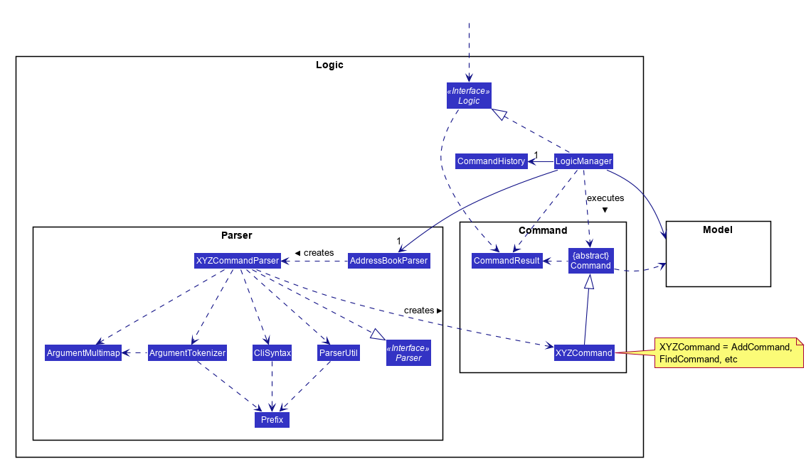

# Developer Guide 

## Table of Content
1. [Introduction](#1-introduction)
2. [Setting Up](#2-setting-up)
    1. [Prerequisites](#21-prerequisites)
    2. [Importing the project into Eclipse](#22-importing-the-project-into-eclipse)
3. [Design](#3-design)
    1. [Architecture](#31-architecture)
    2. [UI component](#32-ui-component)
    3. [Logic component](#33-logic-component)
    4. [Model component](#34-model-component)
    5. [Storage component](#35-storage-component)
    6. [Common classes](#36-common-classes)
4. [Implementation](#4-implementation)
    1. [Logging](#41-logging)
    2. [Configuration](#42-configuration)
5. [Testing](#5-testing)
6. [Dev Ops](#6-dev-ops)
    1. [Build Automation](#61-build-automation)
    2. [Continuous Integration](#62-continuous-integration)
    3. [Making a Release](#63-making-a-release)
    4. [Managing Depedencies](#64-managing-depedencies)
7. [Appendix](#7-appendix) 
    1. [Appendix A: User Stories](#71-appendix-a--user-stories)
    2. [Appendix B: Use Cases](#72-appendix-b--use-cases)
    3. [Appendix C: Non Functional Requirements](#73-appendix-c--non-functional-requirements)
    4. [Appendix D: Glossary](#74-appendix-d--glossary)
    5. [Appendix E : Product Survey](#75-appendix-e--product-survey)

## 1. Introduction
Welcome to the developer guide for SmartyDo. This guide is meant to enable budding developers like yourself to better understand the implementation of our program. Through this guide, we hope that you will be able to learn not only about how SmartyDo is implemented, but about different parts of the application that you are able to improve yourself.

## 2. Setting up

#### 2.1 Prerequisites
To ensure that you are able to run SmartyDo smoothly, do ensure that you have met the following prerequisites:

1. Installed **JDK `1.8.0_60`**  or later 

    > Having any Java 8 version is not enough.  
    This app will not work with earlier versions of Java 8.
    
2. Installed **Eclipse** IDE
3. Installed **e(fx)clipse** plugin for Eclipse (Do the steps 2 onwards given in
   [this page](http://www.eclipse.org/efxclipse/install.html#for-the-ambitious))
4. Installed **Buildship Gradle Integration** plugin from the Eclipse Marketplace

#### 2.2 Importing the project into Eclipse
To import the lastest version of this project into Eclipse, follow the instructions as given below:

0. Fork this repo, and clone the fork to your computer
1. Open Eclipse (Note: Ensure you have installed the **e(fx)clipse** and **buildship** plugins as given 
   in the prerequisites above)
2. Click `File` > `Import`
3. Click `Gradle` > `Gradle Project` > `Next` > `Next`
4. Click `Browse`, then locate the project's directory
5. Click `Finish`

  > * If you are asked whether to 'keep' or 'overwrite' config files, choose to 'keep'.
  > * Depending on your connection speed and server load, it can even take up to 30 minutes for the set up to finish
      (This is because Gradle downloads library files from servers during the project set up process)
  > * If Eclipse auto-changed any settings files during the import process, you can discard those changes.

## 3. Design

### 3.1 Architecture

 
The **_Architecture Diagram_** given above will explain to you the high-level design of the App.
Below, we will give you a quick overview of each component.

`Main` has only one class called [`MainApp`](../src/main/java/seedu/address/MainApp.java). It is responsible for,
* At app launch: `Main` will initialize the components in the correct sequence, and connect them up with each other.
* At shut down: `Main` will Shut down the components and invoke cleanup method where necessary.

[**`Commons`**](#36-common-classes) represents a collection of classes used by multiple other components.
Two of those classes play important roles at the architecture level.
* `EventsCentre` : This class (written using [Google's Event Bus library](https://github.com/google/guava/wiki/EventBusExplained))
  is used by components to communicate with other components using events (i.e. a form of _Event Driven_ design)
* `LogsCenter` : Used by many classes to write log messages to the App's log file.

The rest of the App consists four components.
* [**`UI`**](#32-ui-component) : The UI of tha App.
* [**`Logic`**](#33-logic-component) : The command executor.
* [**`Model`**](#34-model-component) : Holds the data of the App in-memory.
* [**`Storage`**](#35-storage-component) : Reads data from, and writes data to, the hard disk.

Each of the four components will
* Define its _API_ in an `interface` with the same name as the Component.
* Expose its functionality using a `{Component Name}Manager` class.

For example, the `Logic` component (see the class diagram given below) defines it's API in the `Logic.java`
interface and exposes its functionality using the `LogicManager.java` class. 
 

The _Sequence Diagram_ below will show you how the components interact for the scenario where the user issues the
command `delete 3`.

>Note how the `Model` simply raises a `ToDoChangedEvent` when the To-Do data are changed,
 instead of asking the `Storage` to save the updates to the hard disk.

The diagram below will show you how the `EventsCenter` reacts to that event, which eventually results in the updates
being saved to the hard disk and the status bar of the UI being updated to reflect the 'Last Updated' time.  

> Note how the event is propagated through the `EventsCenter` to the `Storage` and `UI` without `Model` having
  to be coupled to either of them. This is an example of how this Event Driven approach helps us reduce direct 
  coupling between components.

The sections below will give you more details of each component.

### 3.2 UI component

 

**API** : [`Ui.java`](../src/main/java/seedu/address/ui/Ui.java)

The UI consists of a `MainWindow` that is made up of parts e.g.`CommandBox`, `ResultDisplay`, `TaskListPanel`,
`StatusBarFooter`, `BrowserPanel` etc. All these, including the `MainWindow`, inherit from the abstract `UiPart` class
and they can be loaded using the `UiPartLoader`.

The `UI` component uses JavaFx UI framework. The layout of these UI parts are defined in matching `.fxml` files
 that are in the `src/main/resources/view` folder. 
 For example, the layout of the [`MainWindow`](../src/main/java/seedu/address/ui/MainWindow.java) is specified in
 [`MainWindow.fxml`](../src/main/resources/view/MainWindow.fxml)

The `UI` component will
* Execute user commands using the `Logic` component.
* Bind itself to some data in the `Model` so that the UI can auto-update when data in the `Model` change.
* Respond to events raised from various parts of the App and updates the UI accordingly.

### 3.3 Logic component

 

**API** : [`Logic.java`](../src/main/java/seedu/address/logic/Logic.java)

1. `Logic` uses the `Parser` class to parse the user command.
2. This results in a `Command` object which is executed by the `LogicManager`.
3. The command execution can affect the `Model` (e.g. adding a task) and/or raise events.
4. The result of the command execution is encapsulated as a `CommandResult` object which is passed back to the `Ui`.

Below, you will find the Sequence Diagram for interactions within the `Logic` component for the `execute("delete 1")`
 API call. 
 

### 3.4 Model component

 

**API** : [`Model.java`](../src/main/java/seedu/address/model/Model.java)

The `Model`,
* stores a `UserPref` object that represents the user's preferences.
* stores the To-Do data.
* exposes a `UnmodifiableObservableList<ReadOnlyTask>` that can be 'observed' e.g. the UI can be bound to this list
  so that the UI automatically updates when the data in the list change.
* does not depend on any of the other three components.

### 3.5 Storage component

 

**API** : [`Storage.java`](../src/main/java/seedu/address/storage/Storage.java)

The `Storage` component,
* can save `UserPref` objects in json format and read it back.
* can save the SmartyDo data in xml format and read it back.

### 3.6 Common classes

You may find classes used by multiple components are in the `seedu.addressbook.commons` package.

## 4. Implementation

### 4.1 Logging

We are using `java.util.logging` package for logging. You can use `LogsCenter` class to manage the logging levels
and logging destinations.

* You can controll the logging level by using the `logLevel` setting in the configuration file
  (See [Configuration](#configuration))
* You can obtain the `Logger` for a class by using `LogsCenter.getLogger(Class)` which will log messages according to
  the specified logging level
* Currently log messages are output through: `Console` and to a `.log` file.

**Logging Levels**

* `SEVERE` : Critical problem detected which may possibly cause the termination of the application
* `WARNING` : Can continue, but with caution
* `INFO` : Information showing the noteworthy actions by the App
* `FINE` : Details that is not usually noteworthy but may be useful in debugging
  e.g. print the actual list instead of just its size

### 4.2 Configuration

You can controll certain properties of the application (e.g App name, logging level) through the configuration file 
(default: `config.json`):

## 5. Testing

You can find tests in the `./src/test/java` folder.

**In Eclipse**:
> If you are not using a recent Eclipse version (i.e. _Neon_ or later), you will need to enable assertions in JUnit tests
  as described [here](http://stackoverflow.com/questions/2522897/eclipse-junit-ea-vm-option).

* You can run all tests by right-clicking on the `src/test/java` folder and choose
  `Run as` > `JUnit Test`
* You can also run a subset of tests by right-clicking on a test package, test class, or a test and choose
  to run as a JUnit test.

**Using Gradle**:
* You may refer to [UsingGradle.md](UsingGradle.md) to see how to run tests using Gradle.

We have two types of tests:

1. **GUI Tests** - These are _System Tests_ that test the entire App by simulating user actions on the GUI. 
   These are in the `guitests` package.
  
2. **Non-GUI Tests** - These are tests not involving the GUI. They include,
   1. _Unit tests_ targeting the lowest level methods/classes.  
      e.g. `seedu.address.commons.UrlUtilTest`
   2. _Integration tests_ that are checking the integration of multiple code units 
     (those code units are assumed to be working). 
      e.g. `seedu.address.storage.StorageManagerTest`
   3. Hybrids of unit and integration tests. These test are checking multiple code units as well as 
      how the are connected together. 
      e.g. `seedu.address.logic.LogicManagerTest`
  
**Headless GUI Testing** :
Thanks to the [TestFX](https://github.com/TestFX/TestFX) library we use,
 our GUI tests can be run in the _headless_ mode. 
 In the headless mode, GUI tests do not show up on the screen.
 That means the developer can do other things on the Computer while the tests are running. 
 See [UsingGradle.md](UsingGradle.md#running-tests) to learn how to run tests in headless mode.
  
## 6. Dev Ops

### 6.1 Build Automation

You may read [UsingGradle.md](UsingGradle.md) to learn how to use Gradle for build automation.

### 6.2 Continuous Integration

We use [Travis CI](https://travis-ci.org/) to perform _Continuous Integration_ on our projects.
You may read [UsingTravis.md](UsingTravis.md) for more details.

### 6.3 Making a Release

Here are the steps to create a new release.
 
 1. Generate a JAR file [using Gradle](UsingGradle.md#creating-the-jar-file).
 2. Tag the repo with the version number. e.g. `v0.1`
 2. [Crete a new release using GitHub](https://help.github.com/articles/creating-releases/) 
    and upload the JAR file your created.
 
### 6.4 Managing Dependencies

A project often depends on third-party libraries. For example, SmartyDo depends on the
[Jackson library](http://wiki.fasterxml.com/JacksonHome) for XML parsing. Managing these _dependencies_
can be automated using Gradle. For example, Gradle can download the dependencies automatically, which
is better than these alternatives. 
a. Include those libraries in the repo (this bloats the repo size) 
b. Require developers to download those libraries manually (this creates extra work for developers) 

  
## 7. Appendix

## 7.1 Appendix A : User Stories

Priorities: High (must have) - `* * *`, Medium (nice to have)  - `* *`,  Low (unlikely to have) - `*`

Priority | As a ... | I want to ... | So that I can...
-------- | :-------- | :--------- | :-----------
`* * *` | new user | see usage instructions | refer to instructions when I forget how to use the App
`* * *` | user | add a task by specifying a task description only | record tasks that need to be done  
`* * *` | user | delete a task | remove entries that I no longer need
`* * *` | user | find a task by name | locate details of tasks without having to go through the entire list
`* * *` | user |view list of completed and pending tasks | keep track of what needs to be done
`* *` | user with many tasks at a time | sort my tasks by different criteria | view tasks easily
`* *` | user with large projects/ tasks | add subtasks to main task | break down larger task into smaller tasks 
`* *` | user with many uncofirmed events | allocate timeslots for tentative meetings/tasks | avoid having plans that might conflict with unconfirmed plans
`* *` | user | undo  1 previous operation | remove commands executed by accident   
`* *` | user | specify a target folder as the data storage location | synchronise file with other applications

## 7.2 Appendix B : Use Cases

(For all use cases below, the **System** is the `SmartyDo` and the **Actor** is the `user`, unless specified otherwise)

### Use case: Add task

**MSS**

1. User requests to add new task
2. SmartyDo shows list of upcoming tasks with new task added  
Use case ends.

**Extensions**

1a. The given index is invalid

> Use case ends

### Use case: Edit task

**MSS**

1. User requests to view upcoming tasks
2. SmartyDo shows a list of upcoming tasks
3. User requests to edit a specific task in the list
4. SmartyDo edits the task  
Use case ends.

**Extensions**

2a. The list is empty

> Use case ends

3a. The given index is invalid

> 3a1. SmartyDo shows an error message  
  Use case resumes at step 2

### Use case: Undo task

**MSS**

1. User requests to undo the previous command
2. SmartyDo performs undo and shows updated list of upcoming tasks  
Use case ends.

**Extensions**

1a. There is no previous command

> Use case ends

### Use case: Redo task

**MSS**

1. User requests to redo the command reversed by the undo command
2. SmartyDo performs redo and shows updated list of upcoming tasks  
Use case ends.

**Extensions**

1a. There is no previous undo command

> Use case ends

### Use case: View task

**MSS**

1. User requests to view upcoming tasks that matches specific `string`
2. SmartyDo shows a list of upcoming tasks  
Use case ends.

### Use case: Mark task

**MSS**

1. User requests to view upcoming tasks
2. SmartyDo shows a list of upcoming tasks
3. User requests to mark a specific task in the list
4. SmartyDo marks the task  
Use case ends.

**Extensions**

2a. The list is empty

> Use case ends

3a. The given index is invalid

> 3a1. SmartyDo shows an error message  
  Use case resumes at step 2

### Use case: Delete task

**MSS**

1. User requests to view upcoming tasks
2. SmartyDo shows a list of upcoming tasks
3. User requests to delete a specific task in the list
4. SmartyDo deletes the task  
Use case ends.

**Extensions**

2a. The list is empty

> Use case ends

3a. The given index is invalid

> 3a1. SmartyDo shows an error message  
  Use case resumes at step 2

{More to be added}

## 7.3 Appendix C : Non Functional Requirements

1. Should work on any [mainstream OS](#mainstream-os) as long as it has Java `1.8.0_60` or higher installed.
2. Should be able to hold up to 2 years of entries estimated to be 8000 entries.
3. Should come with automated unit tests and open source code.
4. Should favor DOS style commands over Unix-style commands.

{More to be added}

## 7.4 Appendix D : Glossary

##### Mainstream OS

> Windows, Linux, Unix, OS-X

##### Private contact detail

> A contact detail that is not meant to be shared with others

## 7.5 Appendix E : Product Survey

| Existing Product | Pros | Cons |
| :---: | :---: | :---: |
| Google Calendar | Allows creation of task and events and reside them in the same view. Free to use. Synchronises with gmail account. Allows conversion of email invites into events | Does not have blockout slots |
| Sticky Notes | Free on Windows Store. Always open. Easy to bring up. Shows all items, always. Easy addition/editing/removal of tasks.  Can store notes/weblinks. Can store handwritten notes. Supports basic text formatting. |  No backup mechanism. Unable to change font. Manual sorting. Resets to default settings on restart. No “calendar view”. Takes up desktop space. Unable to minimise. Can be quite cluttered and messy|
| Todo.txt | Does not rely on network access to operate. Able to synchronise with cloud storage. Allows priority scheduling. Breaks difficult objectives into small steps to reach the goal. Records date of completion for tasks. Simple GUI and lightweight Application | No support for recurring tasks. No reminder for upcoming due dates |

