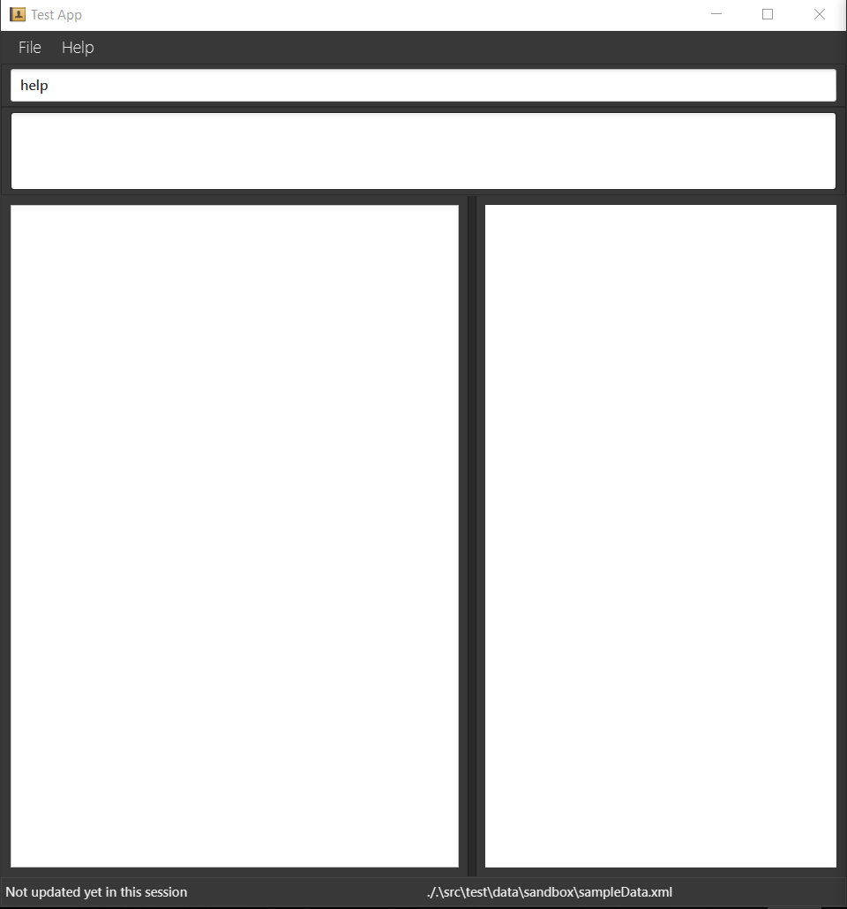
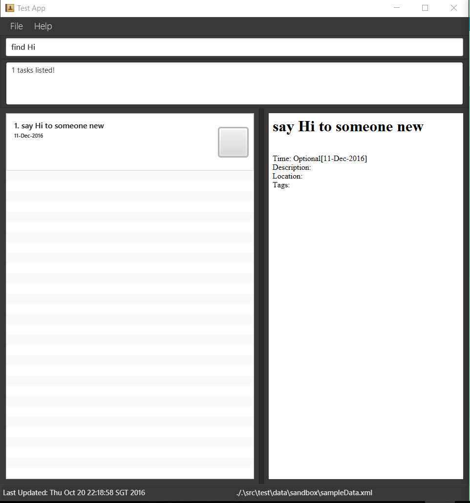
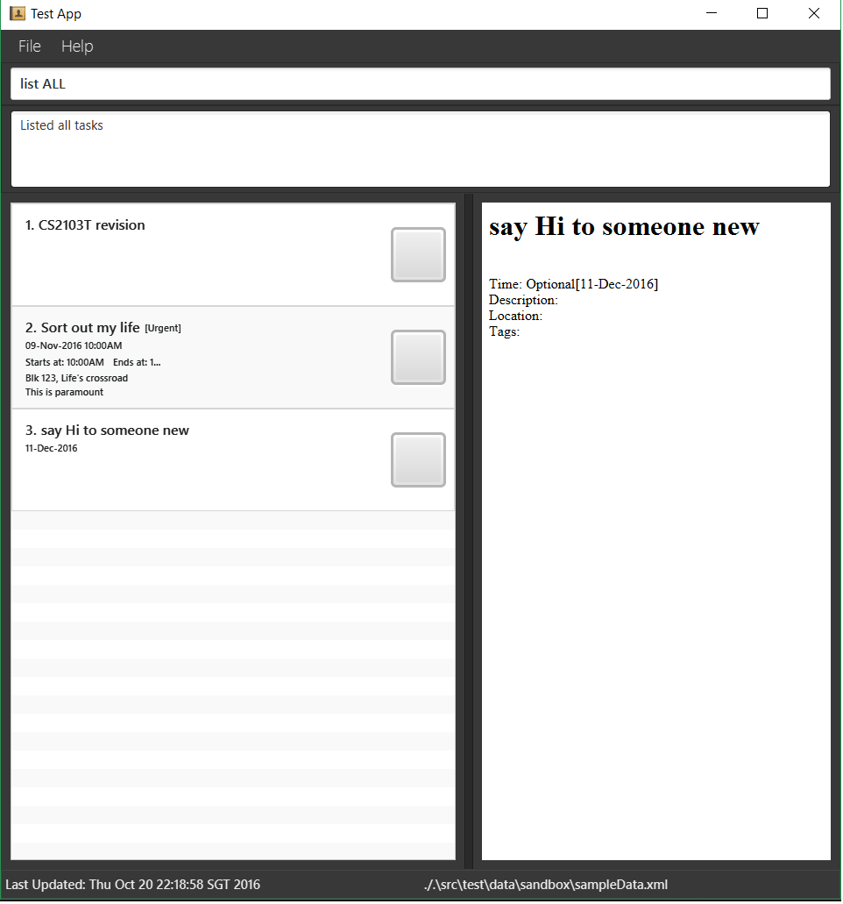

# User Guide

## Table of Contents
1. [Introduction](#1-introduction)
2. [Quick Start](#2-quick-start)
3. [Getting Started](#3-getting-started)
  1. [Requesting Help From SmartyDo](#31-requesting-help-from-smartydo)
  2. [Adding Task Into SmartyDo](#32-adding-task-into-smartydo)
  3. [Viewing Details Of Specific Task](#33-viewing-details-of-specific-task)
  4. [Finding Specific Tasks](#34-finding-specific-tasks)
  5. [List Filter](#35-list-filter)
  5. [Editing Task Details](#36-editing-task-details)
  6. [Undoing And Redoing Commands](#37-undoing-and-redoing-commands)
  7. [Deleting Tasks](#38-deleting-tasks)
  8. [Marking Completed Tasks](#39-marking-completed-tasks)
  9. [Exiting SmartyDo](#310-exiting-smartydo)
4. [Smart Features](#4-smart-features)
  1. [FlexiCommand](#41-flexicommand)
  2. [Saving The Data](#42-saving-the-data)
5. [Command Summary](#5-command-summary)

<!-- /MarkdownTOC -->

## 1. Introduction
SmartyDo is a **to-do-list** application. With SmartyDo, forgetting upcoming deadlines and sleepless nights over incomplete tasks are a thing of the past. SmartyDo **increases your efficiency** by showing the lists of tasks that can be completed simultaneously. Treat SmartyDo like your personal assistant and just focus on **completing your tasks**!

## 2. Quick Start
**Launch SmartyDo**: Simply double-click on the `SmartyDo.jar` file to start SmartyDo. You will be greeted with a simple interface that has four parts a **Browser Panel**, a **Visual Panel**, a **Message Box** and a **Command Bar**. Screenshot below shows SmartyDo's interface.

 Figure 2. Welcome Screen 

**Command Bar** is where you enter short commands to tell SmartyDo what to do. 
**Browser Panel** is where you can view the details of your tasks. 
**Visual Panel** is where you can see a comprehensive list of your tasks. 
**Message Box** shows the result of your command. 

## 3. Getting Started
**Command Format** 
Words in `lower case` are the command. 
Words in `upper case` are the parameters. 
Items in `square brackets` are optional. 
The order of parameters is flexible.  

### 3.1. **Requesting Help From SmartyDo**

You can always use `help` command when you forgot the commands and its format. 

 Figure 3.1. Example of help command 

Format: `help`

**Example:** 
- Enter `help` into command box in order to view the list of commands.

### 3.2. **Adding Task Into SmartyDo**

To add a task into SmartyDo, you need to use `add` command. There are number of paramaters you can enter with `add` command. 

Here is the summary of the parameters and their usage:

| Parameter     |     Flag     |   Format Requirements    | Optional |
| ------------- |:-------------:| -----:|:---:|
| `TASK_NAME`   |   _**/n**_  | _**/n**_ required if `TASK_NAME` is not the first parameter | No |
| `DATE_TIME` |    **t;**  | [Date] [Start_Time] [End_Time] , delimited by spaces    | Yes |
| `TAG`         | _**t/**_ | alphanumeric | Yes |
| `LOCATION` | _**a;**_ |  alphanumeric  | Yes |
| `DESCRIPTION` | _**d;**_ | alphanumeric | Yes |

- `TASK_NAME` is the name of the task and this parameter is compulsary.
- `Date` is the date of the task supports date format of
dd/mmm/yyyy eg:20-Jan-2017 and dd/mm/yyyy with `/` interchangleable with `.` and `-` eg: 20-01-2017.
- `START_TIME` and `END_TIME` is the starting time and ending time of the task respectively. You may consider to use these parameters when starting time and/or deadline is known. You may omit the details of 'DATE_TIME' which will result in a task that has no time frame.
- `TAG` is the characteristic you can add to the task. Such tags can be "Urgent", "HighPriority" and etc.
- `LOCATION` is the place of task being done. You can use this parameter to remind you where to go to complete the task.
- 'DESCRIPTION' is where you can include some extra information about your task.

Format : `add TASK_NAME [t; DATE START_TIME] [a;LOCATION] [t/TAG] [d;`

> You don't have to enter the optional parameters when you don't need them. The order of the parameters are not fixed. You can enter the parameters in any order. For example, `add t/[TAG] t; DATE START_TIME ` is also correct format.

**Example:** 
Let's say you want to add task named "Sort out my life" which you plan to complete on 9 November 2016 from 10:00AM till 12:00PM with tag "Urgent". All you need to do is enter the following as shown below.

 Figure 3.2. Example of add command 

After entering the command, MessageBox will show you task is successfully added into SmartyDo and you will see the updated list of task in the VisualBox.

### 3.3. **Viewing Details Of Specific Task**

View the task/day/month/year/list identified by the parameter. A full detailed description will appear in a pop up window.

Format: `view PARAM`

**Example:** 
Let's say you want to know detailed information about the third task in the Visual Panel. All you need to do is enter `view 3` into command bar, just as shown below.

 Figure 3.3. Example of view command 

After entering the command, Browser Panel will show a detailed description about task 3.

### 3.4. **Finding Specific Tasks**

If you want to find tasks that contain specific keyword in their name, you can use `find` command. `find` command is a command that will list all the tasks matching atleast one keyword. You can enter more than one keyword for `find` command.

Format: `find KEYWORD [MORE_KEYWORDS]`

 Figure 3.4. Example of find command 

> Beware that keywords are case sensitive and only the task's name is searched. However, the order of the keywords does not matter. e.g. `find cs2103 project` is same as `find project cs2103`

### 3.5. **List Filter**

You can filter the list of tasks that you are viewing on the Visual Panel.

Format: `list KEYWORD` where KEYWORD in this case are any of the following: ALL/COMPLETED/INCOMPLETE/UPCOMING

For example, after finding specific tasks, to return the Visual Panel back to where it lists all the tasks, simply input `list ALL` just as shown below.

 Figure 3.5. Example of list command 

### 3.6. **Editing Task Details**

You might want to edit details of a task for several reasons. For example, when deadline was extended you will need to update the SmartyDo for this change. Using `edit` command will solve this problem.

Format: `edit INDEX PARAMETER_TYPE NEW_VALUE`

PARAMETER_TYPE the type of the parameter we want to change and NEW_VALUE is the new value for that parameter.  
`edit` command edits the task at the specified INDEX. You can easily identify the INDEX of the task by looking at the Visual Panel.  
If the task you want to edit is not shown in the Visual Panel, you can use `view` or `find` command to find the required task.  

**Example:** 
Let's say you want to add deadline time for task named "CS2103T revision". Then, you must first check the INDEX of that task. In this case, the INDEX of the task is 1. So to add deadline for this task, enter `edit 1 t; DEADLINE`. This will update the deadline of the task. A demonstration of this functionality shown below.

 Figure 3.6. Before(left) and after(right) of an edit command 

### 3.7. **Undoing And Redoing Commands**

With `undo`, you are allowed to reverse your previous changes sequentially while `redo` allows you to reverse the change done by `undo`. 

- `undo` command requires the application to have executed atleast one undoable command after launching.
- `redo` command requires the application to have executed atleast one succussful `undo` command after launching.

| Undoable Commands |
| ----------------- |
| `add`         |
| `delete`      |
| `edit`      |  
| `mark`      |

> SmartyDo **does not store** history of actions in your computer.
> Your history of actions resets when SmartyDo is launched.
> Also, if you enter any undoable command after entering `redo` or `undo`, your history of actions would be _**removed**_.  

Format: `undo`, `redo`

**Example:** 
Let's say you have added a task and your friend told you that he has already done it for you. You would like to undo it. You can undo it as long as you just added it, as shown below.

 Figure 3.7.1. Before(left) and after(right) of an undo command 

By entering `undo` command, SmartyDo updates your list of tasks to how it was before you executed an undoable action. From the screenshot above, you can see that task named "task to be undone" is no longer there anymore.

However, you realized that your friend was wrong and you want to add the task back again. In this case, you do not need to use add command again. Instead you can simply use `redo` command, as shown below.

 Figure 3.7.1. Before(left) and after(right) of an redo command 

By using `redo` command, SmartyDo updates your list of tasks to how it was before you executed `undo` command. From the screenshot above, you can see that the "task to be undone" task has been recovered.

### 3.8. **Deleting Tasks**

Sometimes, you may also want to delete tasks due to unexpected circumstances. To help you to handle such problem, `delete` command can be used. `delete` command is simply deleting task from SmartyDo.

Format: `delete INDEX`

Similar to `edit` command, `delete` command also uses INDEX. INDEX can be found in Visual Panel by using `view` command and `find` command.

**Example:** 
If you want to delete specfic task, find the INDEX of that task. Let's say the INDEX is 1. Then, enter `delete 1` in the command bar.

 Figure 3.8. Example of delete command 

After entering `delete` command, SmartyDo will delete the task specified by the INDEX and will show the updated list in the Visual Panel. In the screenshot above, you can see that "task to be undone" task has been deleted from SmartyDo.

### 3.9. **Marking Completed Tasks**

Instead of deleting the task, you may want to mark the task as complete and store the details of the task in the SmartyDo. In this case, you can use `done` command. By using `done` command, you can easily identify the completed tasks from the list.

Format: `done INDEX`

Similar to `delete` command and `edit` command, INDEX is used in `done` command.

**Example:** 
You have now completed the task named "User Guide" and now you want to mark this task as complete. To do this, you will need to check the INDEX of this task. In this case, INDEX of this task is 1. So, entering `done 1` will mark "User Guide" task as complete.

 Figure 3.9. Example of done command 

After entering the `done` command, you are now able to identify the completed task easily from the list.

### 3.10. **Exiting SmartyDo**

After using SmartyDo, you can exit the program by using `exit` command.

Format: `exit`

By entering `exit` command in the command box, SmartyDo will quit and save the data.

## 4. Smart Features

### 4.1. **FlexiCommand**
It is okay if you cannot remember the syntax entirely! As long as you remember the keyword some reshuffling of the parameters entered is fine. Our program will ask you for confirmation if we are unsure what you want.

### 4.2. **Saving The Data**
SmartyDo data are saved in the hard disk automatically after any command that changes the data.
There is no need to save manually.

## 5. **Command Summary**
|**Command**|**Parameters**|**Format**|
|:---------:|:--------:|-------|
|Help   || `help`|
|Add      |TASK_NAME, DATE_TIME,[LOCATION], [TAG] |`add /n TASK_NAME d; DATE START_TIME END_TIME t/ TAG a; LOCATION `|
|View     |PARAM|`view PARAM`|
|Find     |KEYWORD, [MORE_KEYWORD]|`find KEYWORD [MORE_KEYWORD]`|
|Edit     |INDEX|`edit INDEX`|
|Undo     ||`undo`|
|Redo     ||`redo`|
|Done     |INDEX|`done INDEX`|
|Exit     ||`exit`|
