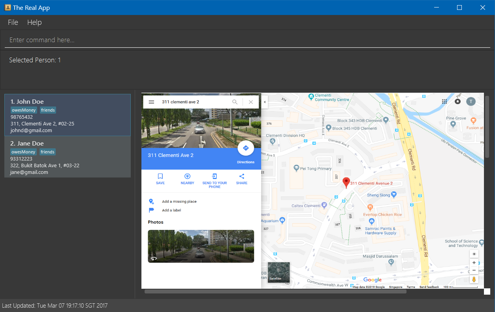

# User Guide

* [Quick Start](#quick-start)
* [Features](#features)
* [FAQ](#faq)
* [Command Summary](#command-summary)

## Quick Start

0. Ensure you have Java version `1.8.0_60` or later installed in your Computer. 
   > Having any Java 8 version is not enough.  
   This app will not work with earlier versions of Java 8.
   
1. Download the latest `addressbook.jar` from the [releases](../../../releases) tab.
2. Copy the file to the folder you want to use as the home folder for your Address Book.
3. Double-click the file to start the app. The GUI should appear in a few seconds. 
   > 

4. Type the command in the command box and press <kbd>Enter</kbd> to execute it.  
   e.g. typing **`help`** and pressing <kbd>Enter</kbd> will open the help window. 
5. Some example commands you can try:
   * **`list`** : lists all contacts
   * **`add`**` John Doe p/98765432 e/johnd@gmail.com a/John street, block 123, #01-01` : 
     adds a contact named `John Doe` to the Address Book.
   * **`delete`**` 3` : deletes the 3rd contact shown in the current list
   * **`exit`** : exits the app
6. Refer to the [Features](#features) section below for details of each command. 

## Features

> **Command Format**
> * Words in `UPPER_CASE` are the parameters.
> * Items in `SQUARE_BRACKETS` are optional.
> * Items with `...` after them can have multiple instances.
> * The order of parameters is fixed.

#### Viewing help : `help`
Format: `help`

> Help is also shown if you enter an incorrect command e.g. `abcd`
 
#### Adding a person: `add`
Adds a person to the address book 
Format: `add NAME p/PHONE_NUMBER e/EMAIL a/ADDRESS [t/TAG]...` 

> Persons can have any number of tags (including 0)

Examples: 
* `add John Doe p/98765432 e/johnd@gmail.com a/John street, block 123, #01-01`
* `add Betsy Crowe p/1234567 e/betsycrowe@gmail.com a/Newgate Prison t/criminal t/friend`

#### Listing all persons : `list`
Shows a list of all persons in the address book. 
Format: `list`

#### Finding all persons containing any keyword in their name: `find`
Finds persons whose names contain any of the given keywords. 
Format: `find KEYWORD [MORE_KEYWORDS]`

> * The search is case sensitive. e.g `hans` will not match `Hans`
> * The order of the keywords does not matter. e.g. `Hans Bo` will match `Bo Hans`
> * Only the name is searched.
> * Only full words will be matched e.g. `Han` will not match `Hans`
> * Persons matching at least one keyword will be returned (i.e. `OR` search).
    e.g. `Hans` will match `Hans Bo`

Examples: 
* `find John` 
  Returns `John Doe` but not `john`
* `find Betsy Tim John` 
  Returns Any person having names `Betsy`, `Tim`, or `John`

#### Deleting a person : `delete`
Deletes the specified person from the address book. Irreversible. 
Format: `delete INDEX`

> Deletes the person at the specified `INDEX`. 
  The index refers to the index number shown in the most recent listing. 
  The index **must be a positive integer** 1, 2, 3, ...

Examples: 
* `list` 
  `delete 2` 
  Deletes the 2nd person in the address book.
* `find Betsy`  
  `delete 1` 
  Deletes the 1st person in the results of the `find` command.

#### Select a person : `select`
Selects the person identified by the index number used in the last person listing. 
Format: `select INDEX`

> Selects the person and loads the Google search page the person at the specified `INDEX`. 
  The index refers to the index number shown in the most recent listing. 
  The index **must be a positive integer** 1, 2, 3, ...

Examples: 
* `list` 
  `select 2` 
  Selects the 2nd person in the address book.
* `find Betsy`   
  `select 1` 
  Selects the 1st person in the results of the `find` command.

#### Clearing all entries : `clear`
Clears all entries from the address book. 
Format: `clear`  

#### Exiting the program : `exit`
Exits the program. 
Format: `exit`  

#### Saving the data 
Address book data are saved in the hard disk automatically after any command that changes the data. 
There is no need to save manually.

## FAQ

**Q**: How do I transfer my data to another Computer? 
**A**: Install the app in the other computer and overwrite the empty data file it creates with 
       the file that contains the data of your previous Address Book folder.
       
## Command Summary

Command | Format  
-------- | :-------- 
Add | `add NAME p/PHONE_NUMBER e/EMAIL a/ADDRESS [t/TAG]...`
Clear | `clear`
Delete | `delete INDEX`
Find | `find KEYWORD [MORE_KEYWORDS]`
List | `list`
Help | `help`
Select | `select INDEX`
