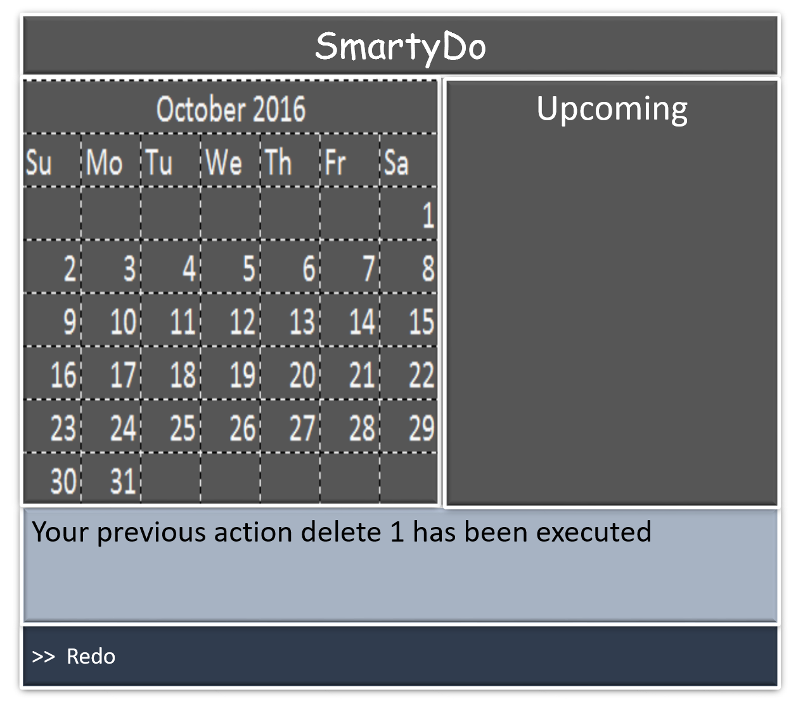
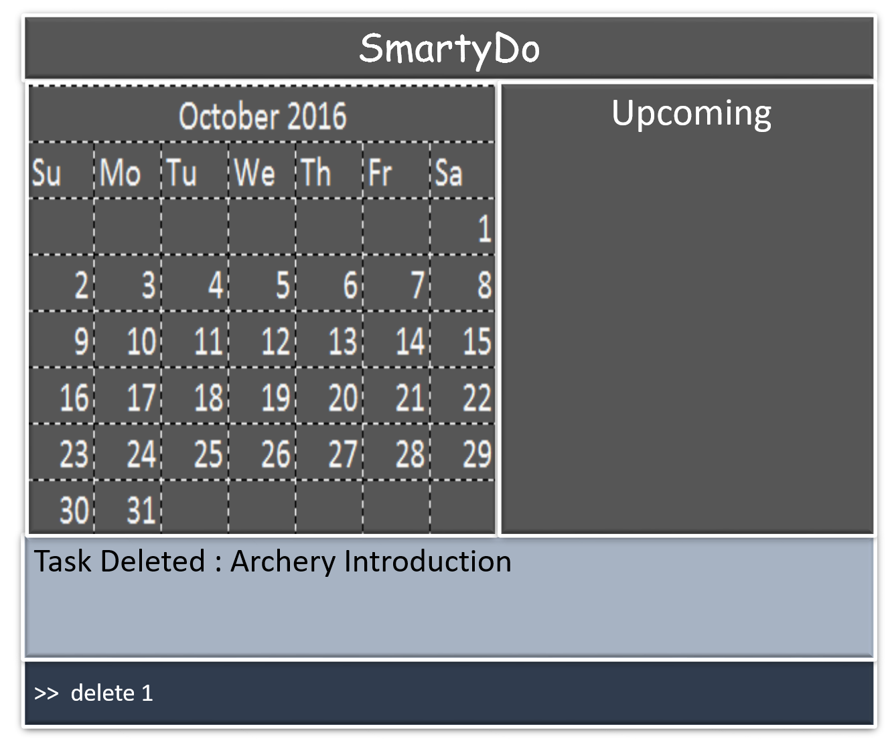

# User Guide

## Table of Contents
1. [Introduction](#1-introduction)
2. [Quick Start](#2-quick-start)
3. [Getting Started](#3-getting-started)
  1. [Help](#31-help)
  2. [Add Tasks](#32-add-tasks)
  3. [View](#33-view)
  4. [Edit Tasks](#34-edit-tasks)
  5. [Undo and Redo](#35-undo-and-redo)
  6. [Delete Tasks](#36-delete-tasks)
  7. [Mark completed tasks](#37-mark-completed-tasks)
  8. [Suggest available timeslots](#38-suggest-available-timeslots)
  9. [Find](#39-find)
  10. [Exit](#310-exit)
4. [Smart Features](#4-smart-features)
  1. [FlexiCommand](#41-flexicommand)
  2. [Saving the data](#42-saving-the-data)

<!-- /MarkdownTOC -->

## 1. Introduction
SmartyDo is a **to-do-list** application. With SmartyDo, forgetting upcoming deadlines and sleepless nights over incomplete tasks are a thing of the past. SmartyDo **increases your efficiency** by showing the lists of tasks that can be completed simultaneously. Treat SmartyDo like your personal assistant and just focus on **completing your tasks**!

## 2. Quick Start
1. **Launch SmartyDo** Simply double-click on the `SmartyDo.jar` file to start SmartyDo. You will be greeted with a simple interface that has four parts a CalendarBox, a VisualBox, a MessageBox and a command bar. This command bar is where you enter short commands to tell SmartyDo what to do.

 

2. **Letting SmartyDo do the remembering for you** You can simply type the commands you want SmartyDo to execute for you in the command bar. Type “help” or “help [command]” for more information.

3. **Let’s get started**

## 3. Getting Started
**Command Format** 
Words in `UPPER_CASE` are the parameters. 
Items in `SQUARE_BRACKETS` are optional. 
Items with `...` after them can have multiple instances. 
The order of parameters is flexible 

### 3.1. **Help:**
Format: `help`

Help is also shown if you enter an incorrect command e.g. abcd

### 3.2. **Add Tasks:**
Adds a Task to SmartyDo which requires a description of the task `TASK_NAME`. 
You can specify the `[priority]` of the task which enables you to `view` tasks by their importance level for the day. 
If the starting time and/or the deadline of the task is known , you can include it by specifying `[StartTime]` and `[EndTime]`  
Since tasks may be of recurring nature, `[Recur]` frequency can be indicated by entering the frequency.  
By entering the `[Location]`, we will remind you where to go to complete the task.  
Lastly, don't forget to key in the `date`!

Summary of the parameters and their usage

| Parameter     |     Usage     |  	Format Requirements    |
| ------------- |:-------------:| -----:|
| `TASK_NAME`   |    _**/n**_   |       |
| `[Priority]`  |    _**/p**_   | numbers, 1 = highest      |
| `[StartTime]` |    _**/st**_  |       |
| `[EndTime]`   |  _**/et**_    |		    |
| `[Recur]`     | _**/freq X**_ | daily = 1, weekly = 2 , fortnightly = 3, monthly = 4|
| `[Tag]`         | _**#**_ | alphanumeric |
| `[Location]` | _**/loc**_ |  alphanumeric          |
| `Date` | /d | DDMMYY |

Examples:

 

- `add TASK_NAME Date [Priority][Tag][StartTime][EndTime][Recur][location]`

### 3.3. **View:**
View the task/day/month/year/list identified by the parameter. A full detailed description will appear in a pop up window.

Format: `view PARAM`

 

Examples:
- `view 121016` , date format in DDMMYY
- `view year 2016`
- `view month 10`
- `view incomplete tasks`

### 3.4. **Edit Tasks:**
Edit the specified Task from the SmartyDo.

Format: `edit INDEX FIELD NEW_VALUE`

You should first find the task that you wish to edit by using the `view` or `find` command to avoid editing the wrong task entry.  
Edits the task at the specified INDEX. The index refers to the index number shown in the VisualBox. 

The index must be a positive integer 1, 2, 3, ...

Examples:

 

- `edit 1 time 1400`
- Edits the 1st task of the current list. Changes its deadline to 1400 .

- `find homework`
- `edit 1 time 1400`
- Edits the 1st task in the results of the find command. Chanes its deadline to 1400.

### 3.5. **Undo and Redo:**

With `undo`, you are allowed to reverse your previous changes sequentially while `redo` allows you to reverse the change done by `undo`.

Example:

 
- `edit 1 time 1400`
- `undo`

SmartyDo updates your schedule where it was before you executed an undoable action. If you enter `redo`, the most recent `undo` change is reverted.  

 

- `redo`

> If you enter any undoable command after entering `redo` or `undo`, your history of actions would be _**removed**_.  
> You need to have recently asked **SmartyDo** to perform **at least one undoable command** to execute `undo`.  
> As for `redo`, it requires the application to have executed at least one `undo` action recently  

| Undoable Commands |
| ----------------- |
| `add`	   	    |
| `delete`	    |
| `edit`	    |  
| `mark`	    |

> SmartyDo **does not store** history of actions in your computer.
> Your history of actions resets when SmartyDo is launched.

### 3.6. **Delete Tasks:**
Deletes the specified Task from the SmartyDo.

Format: `delete INDEX`

Deletes the task at the specified INDEX. The index refers to the index number shown in the VisualBox.

The index must be a positive integer 1, 2, 3, ...

Examples:

 
- `view 12/10/2016`
- `delete 1`
- Deletes the 1st task of 11/10/2016.

- `find homework`
- `delete 1`
- Deletes the 1st task in the results of the find command.

### 3.7. **Mark completed tasks:**
Marks the task at the specified INDEX as complete. The index refers to the index number shown in the VisualBox.

Example:
<!---
To link to previous "delete" command in final user guide, insert undo command : purpose for making a story
-->

 

- `view 12/10/2016`
- `Done 1`
- Marks the 1st task of 11/10/2016 as completed task.

Format: Done INDEX

### 3.8. **Suggest available timeslots:**
Recommends the list of time blocks for a specified task based on task duration and space availability.

Format: suggest [date][duration]

### 3.9. **Find:**
Finds tasks whose names contain any of the given keywords.

Format: `find KEYWORD [MORE\_KEYWORDS]`
- The search is case sensitive. e.g cs will not match CS
- The order of the keywords does not matter. e.g. project cs2103  will match cs2103 project
- Only the task's name is searched.
- Only full words will be matched e.g. Math will not match Mathematics
- Tasks matching at least one keyword will be returned (i.e. OR search). e.g. Homework will match CS3230 Homework

### 3.10. **Exit:**
Exits the program.

Format: `exit`

## 4. Smart Features

### 4.1. **FlexiCommand**
It is okay if you cannot remember the syntax entirely! As long as you remember the keyword some reshuffling of the parameters entered is fine. Our program will ask you for confirmation if we are unsure what you want.

### 4.2. **Saving the data**
SmartyDo data are saved in the hard disk automatically after any command that changes the data.
There is no need to save manually.
