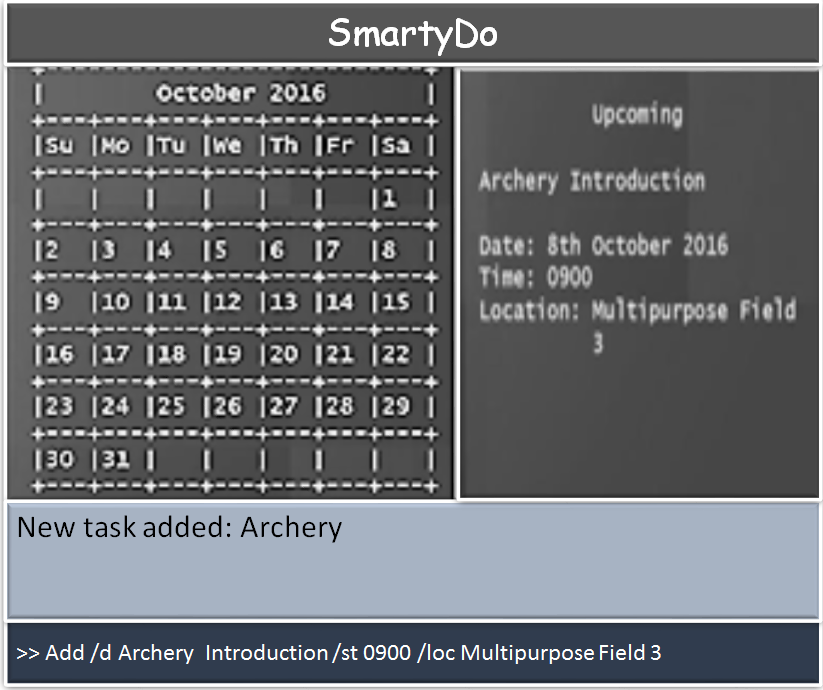

# User Guide

## Table of Contents
1. [Introduction](#1-introduction)
2. [Quick Start](#2-quick-start)
3. [Getting Started](#3-getting-started)
  1. [Requesting Help From SmartyDo](#31-requesting-help-from-smartydo)
  2. [Adding Task Into SmartyDo](#32-adding-task-into-smartydo)
  3. [Viewing Details Of Specific Task](#33-viewing-details-of-specific-task)
  4. [Finding Specific Tasks](#34-finding-specific-tasks)
  5. [Editing Task Details](#35-editing-task-details)
  6. [Undoing And Redoing Commands](#36-undoing-and-redoing-commands)
  7. [Deleting Tasks](#37-deleting-tasks)
  8. [Marking Completed Tasks](#38-marking-completed-tasks)
  9. [Exiting SmartyDo](#39-exiting-smartydo)
4. [Smart Features](#4-smart-features)
  1. [FlexiCommand](#41-flexicommand)
  2. [Saving The Data](#42-saving-the-data)
5. [Command Summary](#5-command-summary)

<!-- /MarkdownTOC -->

## 1. Introduction
SmartyDo is a **to-do-list** application. With SmartyDo, forgetting upcoming deadlines and sleepless nights over incomplete tasks are a thing of the past. SmartyDo **increases your efficiency** by showing the lists of tasks that can be completed simultaneously. Treat SmartyDo like your personal assistant and just focus on **completing your tasks**!

## 2. Quick Start
**Launch SmartyDo**: Simply double-click on the `SmartyDo.jar` file to start SmartyDo. You will be greeted with a simple interface that has four parts a **CalendarBox**, a **VisualBox**, a **MessageBox** and a **Command Bar**. Screenshot below shows SmartyDo's interface.

 

**Command Bar** is where you enter short commands to tell SmartyDo what to do. 
**CalendarBox** is the box that shows calender at the top right corner. 
**VisualBox** is the box where list of tasks are shown. 
**MessageBox** is shows the result of your command. 

## 3. Getting Started
**Command Format** 
Words in `lower case` are the command. 
Words in `upper case` are the parameters. 
Items in `square brackets` are optional. 
The order of parameters is flexible.  

### 3.1. **Requesting Help From SmartyDo**

You can always use `help` command when you forgot the commands and its format. Help is also shown if you enter an incorrect command e.g. abcd  

Format: `help`

**Example:** 
- Enter `help` into command box in order to view the list of commands.

### 3.2. **Adding Task Into SmartyDo**

To add a task into SmartyDo, you need to use `add` command. There are number of paramaters you can enter with `add` command. 

Here is the summary of the parameters and their usage: 

| Parameter     |     Usage     |   Format Requirements    |
| ------------- |:-------------:| -----:|
| `TASK_NAME`   |    _**/n**_   |       |
| `[START_TIME]` |    _**/st**_  |       |
| `[END_TIME]`   |  _**/et**_    |        |
| `[TAG]`         | _**#**_ | alphanumeric |
| `[LOCATION]` | _**/loc**_ |  alphanumeric          |
| `DATE` | **/d** | DDMMYY |

- `TASK_NAME` is the name of the task and this parameter is compulsary.
- `[START_TIME]` and `[END_TIME]` is the starting time and ending time of the task respectively. You may consider to use these parameters when starting time and/or deadline is known.
- `[TAG]` is the characteristic you can add to the task. Such tags can be "Urgent", "HighPriority" and etc.
- `[LOCATION]` is the place of task being done. You can use this parameter to remind you where to go to complete the task.
- `DATE` is the date of the task and this parameter is compulsary.

Format : `add /n TASK_NAME /d DATE #TAG /loc LOCATION /st START_TIME /et END_TIME`

> You don't have to enter the optional parameters when you don't need them. The order of the parameters are not fixed. You can enter the parameters in any order. For example, `add /st START_TIME #TAG /n TASK_NAME /d DATE` is also correct format.

**Example:** 
Let's say you want to add task named "User Guide" which is due 12 October 2016 with tag "CS2103". All you need to do is entering `add #CS2103 /n User Guide /d 121016` into command bar.

 

After entering the command, MessageBox will show you task is successfully added into SmartyDo and you will see the updated list of task in the VisualBox.

### 3.3. **Viewing Details Of Specific Task**

View the task/day/month/year/list identified by the parameter. A full detailed description will appear in a pop up window.

Format: `view PARAM`

**Example:** 
Let's say you want to know detailed information about tasks in 12 October 2016. All you need to do is enter `view 121016` into command box.

 

After entering the command, a popup window will appear and show detailed description about tasks in 12 October 2016.

### 3.4. **Finding Specific Tasks**

If you want to find tasks that contain specific keyword in their name, you can use `find` command. `find` command is a command that will list all the tasks matching atleast one keyword. You can enter more than one keyword for `find` command.

Format: `find KEYWORD [MORE_KEYWORDS]`

> Beware that keywords are case sensitive and only the task's name is searched. However, the order of the keywords does not matter. e.g. `find cs2103 project` is same as `find project cs2103`

### 3.5. **Editing Task Details**

You might want to edit details of a task for several reasons. For example, when deadline was extended you will need to update the SmartyDo for this change. Using `edit` command will solve this problem.

Format: `edit INDEX PARAMETER_TYPE NEW_VALUE`

PARAMETER_TYPE the type of the parameter we want to change and NEW_VALUE is the new value for that parameter.  
`edit` command edits the task at the specified INDEX. You can easily identify the INDEX of the task by looking at the VisualBox.  
If the task you want to edit is not shown in the VisualBox, you can use `view` or `find` command to find the required task.  

**Example:** 
Let's say you want to add deadline time for task named "User Guide". Then, you must first check the INDEX of that task.

 

In this case, the INDEX of the task is 1. So to add deadline for this task, enter `edit 1 /et 1400`. This will update the deadline of the task to 1400.

### 3.6. **Undoing And Redoing Commands**

With `undo`, you are allowed to reverse your previous changes sequentially while `redo` allows you to reverse the change done by `undo`. 

- `undo` command requires the application to have executed atleast one undoable command after launching.
- `redo` command requires the application to have executed atleast one succussful `undo` command after launching.

| Undoable Commands |
| ----------------- |
| `add`         |
| `delete`      |
| `edit`      |  
| `mark`      |

> SmartyDo **does not store** history of actions in your computer.
> Your history of actions resets when SmartyDo is launched.
> Also, if you enter any undoable command after entering `redo` or `undo`, your history of actions would be _**removed**_.  

Format: `undo`, `redo`

**Example:** 
Let's say you have edited the task details by entering `edit 1 /et 1400`. Then, your friend tells you that there is no deadline for that task. In this case, you can reverse back the previous command by using `undo` command.

 

By entering `undo` command, SmartyDo updates your schedule where it was before you executed an undoable action. From the screenshot above, you can see that task named "User Guide" does not have deadline time anymore. 

However, you realized that your friend was wrong and you want to add the deadline time again. In this case, you do not need to use edit command again. Instead you can simply use `redo` command.

 

By using `redo` command, SmartyDo updates your schedule where it was before you executed `undo` command. From the screenshot above, you can see that the "User Guide" task has deadline time again.

### 3.7. **Deleting Tasks**

Sometimes, you may also want to delete tasks due to unexpected circumstances. To help you to handle such problem, `delete` command can be used. `delete` command is simply deleting task from SmartyDo.

Format: `delete INDEX`

Similar to `edit` command, `delete` command also uses INDEX. INDEX can be found in VisualBox by using `view` command and `find` command.

**Example:** 
If you want to delete specficic task, find the INDEX of that task. Let's say the INDEX is 1. Then, enter `delete 1` in the command bar.

 

After entering `delete` command, SmartyDo will delete the task specified by the INDEX and will show the updated list in the VisualBox. In the screenshot above, you can see that "User Guide" task has been deleted from SmartyDo.

### 3.8. **Marking Completed Tasks**

Instead of deleting the task, you may want to mark the task as complete and store the details of the task in the SmartyDo. In this case, you can use `done` command. By using `done` command, you can easily identify the completed tasks from the list.

Format: `done INDEX`

Similar to `delete` command and `edit` command, INDEX is used in `done` command.

**Example:** 
You have now completed the task named "User Guide" and now you want to mark this task as complete. To do this, you will need to check the INDEX of this task. In this case, INDEX of this task is 1. So, entering `done 1` will mark "User Guide" task as complete.

 

After entering the `done` command, you are now able to identify the completed task easily from the list.

### 3.9. **Exiting SmartyDo**

After using SmartyDo, you can exit the program by using `exit` command.

Format: `exit`

By entering `exit` command in the command box, SmartyDo will quit and save the data.

## 4. Smart Features

### 4.1. **FlexiCommand**
It is okay if you cannot remember the syntax entirely! As long as you remember the keyword some reshuffling of the parameters entered is fine. Our program will ask you for confirmation if we are unsure what you want.

### 4.2. **Saving The Data**
SmartyDo data are saved in the hard disk automatically after any command that changes the data.
There is no need to save manually.

## 5. **Command Summary**
|**Command**|**Parameters**|**Format**|
|:---------:|:--------:|-------|
|Help   || `help`|
|Add      |TASK_NAME, DATE, [TAG], [LOCATION], [START_TIME], [END_TIME]|`add /n TASK_NAME /d DATE #TAG /loc LOCATION /st START_TIME /et END_TIME`|
|View     |PARAM|`view PARAM`|
|Find     |KEYWORD, [MORE_KEYWORD]|`find KEYWORD [MORE_KEYWORD]`|
|Edit     |INDEX|`edit INDEX`|
|Undo     ||`undo`|
|Redo     ||`redo`|
|Done     |INDEX|`done INDEX`|
|Exit     ||`exit`|

