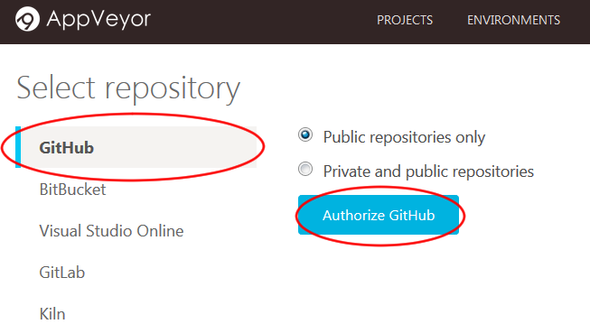
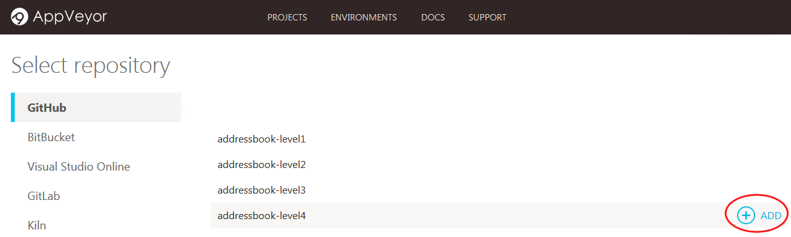
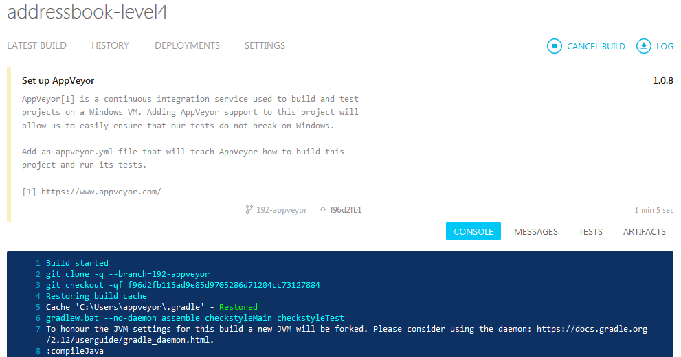
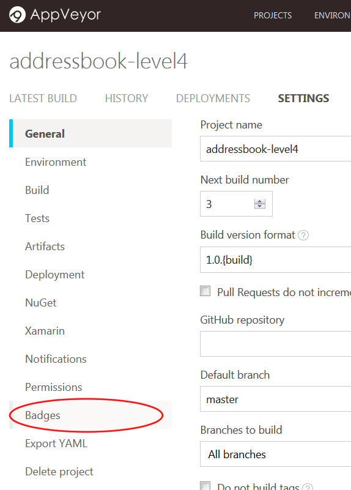

= AppVeyor

https://www.appveyor.com/[AppVeyor] is a _Continuous Integration_ platform for GitHub projects.
It runs its builds on Windows virtual machines.

AppVeyor can run the project's tests automatically whenever new code is pushed to the repo.
This ensures that existing functionality and features have not been broken on Windows by the changes.

The current AppVeyor setup performs the following things whenever someone pushes code to the repo:

* Runs the `gradlew.bat headless allTests` command.
* Automatically retries the build up to 3 times if a task fails.

If you would like to customize your AppVeyor build further, you can learn more about AppVeyor from the https://www.appveyor.com/docs/[AppVeyor Documentation].

== Setting up AppVeyor

. Fork the repo to your own organization.
. Go to https://ci.appveyor.com/, and under `Login`, click on `GitHub` to login with your GitHub account.
  Enter your GitHub account details if needed.
+
image:images/appveyor/login.png[Click on GitHub in the login page]
.  After logging in, you will be brought to your projects dashboard. Click on `NEW PROJECT`.
+
image:images/appveyor/add-project-1.png[Click on "NEW PROJECT" in the projects dashboard]
.  You will be brought to the `Select repository` page. Select `GitHub`.
* On your first usage of AppVeyor, you will need to give AppVeyor authorization to your GitHub account.
Click on `Authorize GitHub`.
+

* This will bring you to a GitHub page that manages the access of third-party applications to your repositories.
+
Depending on whether you are the owner of the repository, you can either grant access:
+
image:images/grant_access.png[Grant Access]
+
Or request access:
+
image:images/request_access.png[Request Access]
. AppVeyor will then list the repositories you have access to in your GitHub account.
  Find the repository you want to set AppVeyor up on, and then click `ADD`.
+

. AppVeyor will then be activated on that repository. To see the CI in action, push a commit to any branch!
* Go to the repository and see the pushed commit.
  There should be an icon which will link you to the AppVeyor build:
+
image:images/appveyor/ci-pending.png[Commit build]
* As the build is run on a remote machine, we can only examine the logs it produces:
+

. Update the link to the "build status" badge at the top of `README.md` to point to the AppVeyor build status of your own repo.
* To find your build status badge URL, first go to your project settings by clicking on the "Settings" icon:
+
image:images/appveyor/project-settings-1.png[Click on project settings]
* Then go to the `Badges` section of your project settings by clicking on it:
+

* Then copy and paste the markdown code for your `master` branch to your `README.md` file:
+
image:images/appveyor/project-settings-3.png[Copy and paste the markdown code for your `master` branch to your `README.md` file]
