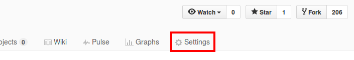

# Using GitHub Pages

[GitHub Pages](https://pages.github.com/) is a static site hosting service that allows users to publish
webpages using files in their GitHub repositories.

## Setting Up

GitHub Pages offers two kinds of sites: user/organization sites and project sites.
Since we are using GitHub Pages to showcase the documentation for our project, we will be creating a project site.

 1. Set up [Travis](UsingTravis.md).
 1. Navigate to the repository's `Settings` tab in GitHub.  
    
 1. Under the GitHub Pages section, choose `gh-pages branch` as the source if it has not been selected.

    > If you cannot choose `gh-pages branch` as the source, try checking if the branch exists.
    > If the branch does not exist, use Git Bash to do the following:
    >
    >  * create the branch: `git checkout --orphan gh-pages`
    >  * remove all files: `git rm -rf .`
    >  * create empty file `index.html` so that we can make a commit
    >  * add and commit `index.html`
    >  * push to `origin`: `git push -u origin gh-pages`
 1. You can now view the site at `https://<username-or-organization-name>.github.io/<repo-name>`.  
    e.g. `https://se-edu.github.io/addressbook-level4`

When Travis is run, it converts the Markdown files to HTML using the asciidoctor Gradle plugin.
It then runs the `deploy_github_pages`. If the commit is to the `master` branch, the generated HTML files are committed to the `gh-pages` branch.
The files in `gh-pages` are then automatically deployed to the project site by GitHub Pages.

## Viewing the Project Site

The project site URL follows the format `https://<username-or-organization-name>.github.io/<repo-name>`,
e.g. `https://se-edu.github.io/addressbook-level4`.
The `index.html` file is displayed on this page.

For the other pages, the structure of the site follows the structure of `docs`.  
For example, `docs/UserGuide.md` is published at `https://<username-or-organization-name>.github.io/addressbook-level4/UserGuide.html`.

## Updating the Project Site

To update the project site, simply edit the documentation files in AsciiDoc and push the changes to GitHub.
Travis & GitHub Pages automatically update the project site when changes are committed to the `master` branch
(e.g. when the commit is pushed to the `master` branch or when the pull request containing the commit is
merged into `master`).
