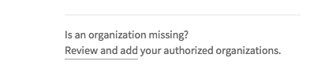

# Travis CI

[Travis CI](https://travis-ci.org/) is a _Continuous Integration_ platform for GitHub projects.

Travis CI can run the projects' tests automatically whenever new code is pushed to the repo.
This ensures that existing functionality and features have not been broken by the changes.

The current Travis CI set up performs the following things whenever someone push code to the repo:
  * Runs the `./gradlew clean headless allTests coverage coveralls -i` command
    (see [UsingGradle.md](UsingGradle.md) for more details on what this command means).
  * Automatically retries the build up to 3 times if a task fails.

If you would like to customise your travis build further, you can learn more about Travis
from [Travis CI Documentation](https://docs.travis-ci.com/).

## Setting up Travis CI

1. Fork the repo to your own organization.
2. Go to https://travis-ci.org/ and click `Sign in with GitHub`, then enter your GitHub account details if needed. 

3. Head to the [Accounts](https://travis-ci.org/profile) page, and find the switch for the forked repository.
    * If the organization is not shown, click `Review and add` as shown below:  
       
      This should bring you to a GitHub page that manages the access of third-party applications.
      Depending on whether you are the owner of the repository, you can either grant access
       
      or request access 
       
      to Travis CI so that it can access your commits and build your code.
    
    * If repository cannot be found, click `Sync account`
4. Activate the switch. 
   
5. This repo comes with a [`.travis.yml`](../.travis.yml) that tells Travis what to do.
   So there is no need for you to create one yourself.
6. To see the CI in action, push a commit to the master branch!  
    * Go to the repository and see the pushed commit. There should be an icon which will link you to the Travis build. 
      

    * As the build is run on a provided remote machine, we can only examine the logs it produces: 
      

7. If the build is successful, you should be able to check the coverage details of the tests
   at [Coveralls](http://coveralls.io/)
8. Update the link to the 'build status' badge at the top of the `README.md` to point to the build status of your
   own repo.